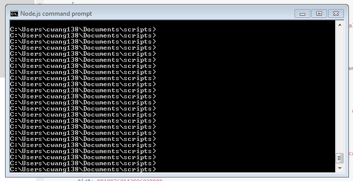
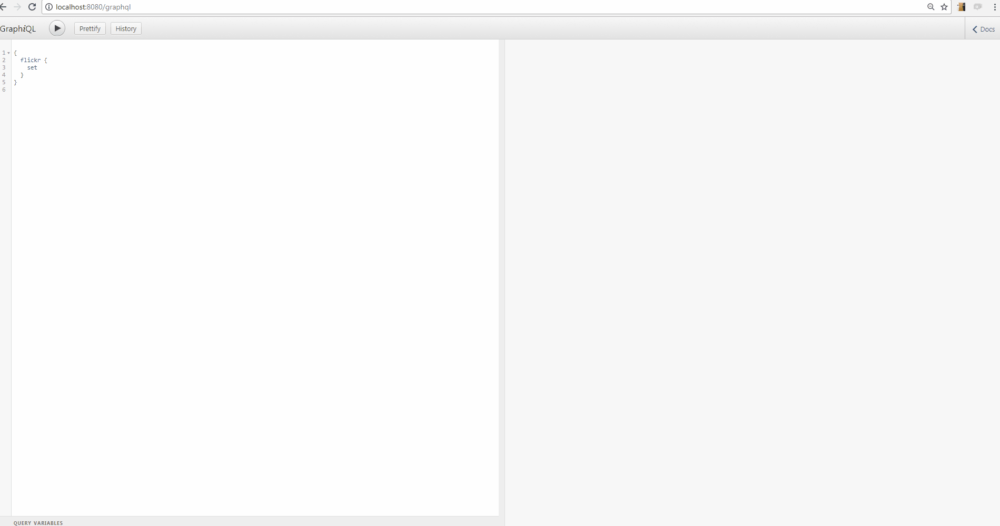

# SocialMonitor project based on GraphQL

## Prerequisite
- [x] Install NodeJS : https://nodejs.org/en/
- [x] In the command line tool, ```cd``` into this project folder and type ```npm install``` to install all the dependency library
- [x] place ```.env``` file (which contains all the social media credentials and access tokens) in the root of this app's directory. Sometimes when you adding this file to your folder, your operating system will automatically overwrite the filename to ```ENV``` or ```ATTXXXX.env``` instead of ```.env```, please double check to make sure. __Please subtitute the tokens and secrets with your own, and DO NOT share it with anyone else.__ https://drive.google.com/file/d/0B8JvcWvoUuxaQnRIN2RyUHdibEk/view?usp=sharing

## Run
- ```npm start``` to invoke the production mode.
- type ```npm test``` to invoke the debugging mode. In this model, any changes in the source code will be reflected immediately upon save


## Ports
- app lives on http://localhost:8080/graphql
- In the browser, access GraphiQL interface by put http://localhost:8080/graphql in the URL
- If you want to write a script to query that enpoint, please refer to "server over http": http://graphql.org/learn/serving-over-http/. My example of code is written in Javascirpt, however you can choose whatever language you're familar with: 
```
var headers = { 
	'Accept': 'application/json',
	'Content-Type':'application/json'
} 

var query = `{
  twitter{
	queryUser(q:"` + keyword + `", count:20){
	  author_id
	  author_id_str
	  name
	  screen_name
	  description
	  author_created_at
	  profile_image_url
	  profile_banner_url
	  url
	  location
	  tweets_count
	  followers_count
	  friends_count
	  listed_count
	  favourites_count
	  statuses_count
	  time_zone
	  protected
	  verified
	  is_translator
	  contributors_enabled
	  geo_enabled
	  lang
	}
  }
}`;

fetch('http://localhost:8080/graphql',
	{method:'POST',
		headers:headers,
		body:JSON.stringify({"query":query })
	}
).then(function(response){
  return response.text();
}).then(function(responseBody){
  // responseObj is the returned data in a stringify format
  // you can do whatever you want to do with this variable: 
  // save it, parse it, put it into a database...
  console.log(responseObj);
	var responseObj = JSON.parse(responseBody);		
}).catch((error) => {
  reject(error);
});
```

## Interface preview
- Interact with GraphQL using default iinterface GraphiQL, which is a web front end written in React
- The left panel is where you type in your queries, using GraphQL query language. 
- The middle panel displays the list of results in the exact same form as your query
- Click Docs on the top-right corner will display the "Documentation Explorer" of the GraphQL, which acts like a reference book if you want to take a look at what query, what parameter and what return data and its data type is going to be.


## Query Examples
```
{
  twitter{
    
    queryUser(q:"trump",count:20,pageNum:1) {
      id
      screen_name
      description
    }
    
    queryTweet(q:"trump",count:100,pages:1){
        id
        text
        created_at
        retweet_count
        user{
          id
          screen_name
          description
        }
      }
}
```

## Readings
- GraphQL blogs: http://graphql.org/blog/
- GraphQL documentations: http://graphql.org/learn/
- Zero to GraphQL in 30 Minutes: https://www.youtube.com/watch?v=UBGzsb2UkeY&t=18s
- NODEJS-Express version of GraphQL: https://www.npmjs.com/package/express-graphql
- Why GraphQL is the future: https://dev-blog.apollodata.com/why-graphql-is-the-future-3bec28193807

